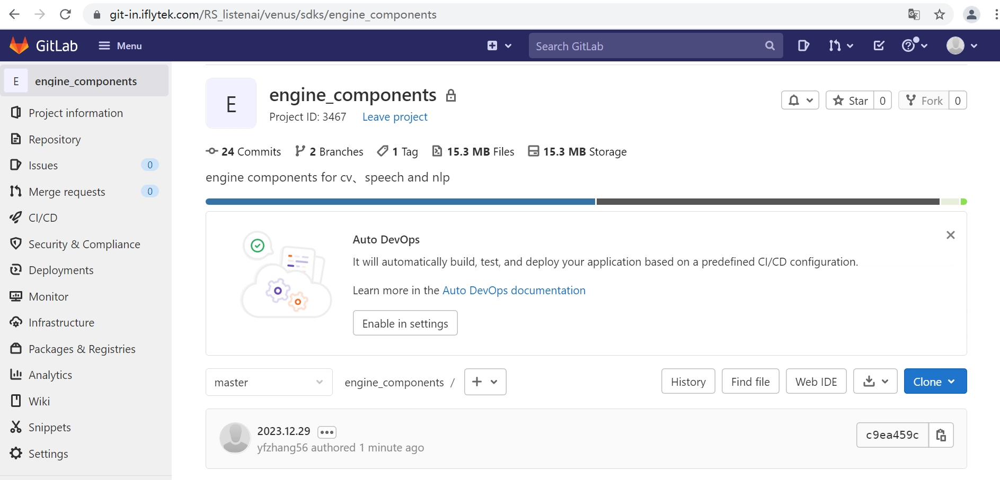

# engine_components

源仓库



引擎通用组件，包括图像、语音和文本处理方向，与聆思的CSK6芯片相适配

## API接口说明文档：
* [cv通用函数接口说明](./docs/CV通用函数接口说明1.0.md)
* 语音处理通用函数接口说明
* 文本处理通用函数接口说明

## c语言代码编译脚本
    ./scripts/build_linux.sh            # linux平台库编译
    ./scripts/build_csk6.sh             # csk6平台库编译

## 结果比对脚本
* 环境配置  
如果想使用result_compare模块对c代码结果和python结果对比，需要配置下python环境，建议使用conda创建虚拟环境
```Shell
conda create -n components-env python==3.7.0 
conda activate components-env 
pip install -U pip 
cat requirements.txt | xargs -n 1 pip install 
```
* 运行测试脚本
```Shell
cd result_compare
python compare_with_opencv.py         # 通过宏控制测试模块的开关
python compare_with_pillow.py         # 通过宏控制测试模块的开关
python compare_with_torchvision.py    # 通过宏控制测试模块的开关
```

## 对比结果一览


|API|Opencv4.8.0	|Torchvision 0.10.0+cu102|PIL 9.4.0|
|:----:|:----:|:----:|:----:|
| rgb2yuv(mode=0)      | 10.55%      | -                        | -         |
| yuv2rgb(mode=0)      | 1.18%       | -                        | -         |
| rgb2yuv(mode=1)      | 11.34%      | -                        | -         |
| yuv2rgb(mode=1)      | 1.31%       | -                        | -         |
| rgb2gray(mode=0)     | 0.02%       | 0.0%                     | 0.0%      |
| gray2rgb(mode=0)     | 0.0%        | -                        | -         |
| rotate(mode=0)       | 0.0%        | 0.0%                     | 0.0%      |
| rotate(mode=1)       | 0.0%        | 0.0%                     | 0.0%      |
| rotate(mode=2)       | 0.0%        | 0.0%                     | 0.0%      |
| rotate(mode=3)       | 0.0%        | 0.0%                     | 0.0%      |
| rotate(mode=4)       | 0.0%        | 0.0%                     | 0.0%      |
| Pad(mode=0)          | 0.0%        | 0.0%                     | 0.0%      |
| Pad(mode=1)          | 0.0%        | 0.0%                     | -         |
| Pad(mode=2)          | 0.0%        | 0.86%                    | -         |
| crop(mode=0)         | 0.0%        | 0.0%                     | 0.0%      |
| resize(mode=0)       | 1.03%       | 27.89%                   | 24.70%    |
| filter(mode=0)均值   | 30.28%      | -                        | 24.82%    |
| filter(mode=1)高斯   | 10.81%      | -                        | 52.51%    |
| filter(mode=2)中值   | 0.004%      | -                        | 0.003%    |
| filter(mode=3)最小值 | -           | -                        | 0.00%     |
| filter(mode=4)最大值 | -           | -                        | 0.00%     |
| normalize            | -           | 0.47%                    | -         |
