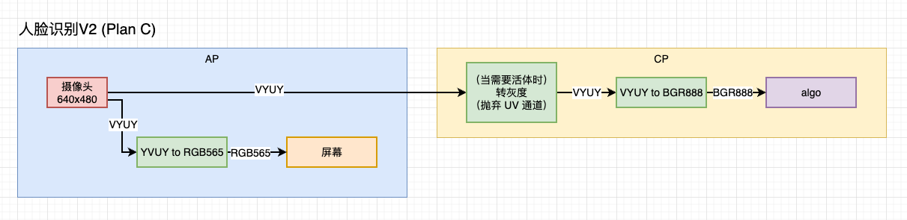

# VYUV to RGB565

## 需求

实现如下的图像格式转换链路：

**VYUY  --->   RGB565** 即从摄像头路到屏幕路的转换。

图片中的模块应该是写错了，应该是**VYUY  --->   RGB565** 而非YVUY to RGB565。




## 实现方法

### 实现原理

RGB565格式实际上就是 **将 3 个 8bit 的R、G、B的数据各自舍弃几个 bit 存放在 2 个字节大小的空间中**，RGB的分配方式是 5 bit、6 bit、5 bit。


r和b都经过了右移运算，舍弃了低三位的信息，g也是舍弃了低二位的信息，所以显示出的颜色能大致符合，稍有色差(实际上是对应了调色板的索引值）。最后的存储格式如下：

{\`\`\`\`\`\`blue\`\`\`\`\`\`\`}  {\`\`\`\`\`\`green\`\`\`\`\`\`\`\`}  {\`\`\`\`\`\`red\`\`\`\`\`\`\`}
b7    b6    b5    b4   b3    g7   g6   g5 | g4     g3   g2   r7    r6     r5    r4    r3 
A17 A16 A15 A14 A13 A12 A11 A10|A07 A06 A05 A04 A03 A02 A01 A00
\[----------------------Addr1------------------][-------------------Addr0---------------------]


### YUV to RGB565代码实现

使用如下计算方法完成 RGB888 ---> RGB565的转换：

```c
*(RGBdata++) =( ((g & 0x1C) << 3) | ( r >> 3) );
*(RGBdata++) =( (b & 0xF8) | ( g >> 5) );
```

**实际上上面其实是RGB565，BGR565应该调换B和R的位置**：<font color = red>注意上图中地址的增大方向</font>

```c
*(RGBdata++) =( ((g & 0x1C) << 3) | ( b >> 3) );
*(RGBdata++) =( (r & 0xF8) | ( g >> 5) );
```


即在原`int32 t yuv2rgb(tData *out, const tData *in, const int32 t mode)`的基础上进行改动：

```c
// 以YCbCr BT.601标准为例：

for(i = 0; i < data size; i++)
{
    uint8_t R,G,B;
    R = SATURATE_U8BITS(floorf((src[i * 3 + 0] * 65536 + 91881 * (src[i * 3 + 1] - 128)) * scale + 0.5));
	G = SATURATE_U8BITS(floorf((src[i * 3 + 0] * 65536 - 22544 * (src[i * 3 + 2] - 128)) - 46793 * (src[i * 3 + 1] - 128)) * scale + 0.5));
	B = SATURATE_U8BITS(floorf((src[i * 3 + 0] * 65536 + 116130 * (src[i * 3 + 2] - 128)) * scale + 0.5));
    
    // 下面就是进行转换,转换为 BGR 在 2 Bytes的情况
    dst[i * 2 + 0] = ( ((G & 0x1C) << 3) | ( R >> 3) );
    dst[i * 2 + 1] = ( (B & 0xF8) | ( G >> 5) );
    
}
```

此时**图像的大小从原本的`height * width * 3` Bytes 变为`height * width * 2` Bytes 。**


### VYUY to RGB565代码实现(old)

与上面的YUV to RGB565不同，上面的YUV存储方式是4:4:4，VYUV是4:2:2存储。

即存储方式为`V0 Y0 U0 Y1 V2 Y2 U2 Y3`。


可以得到下面的处理过程：

```c
// 以YCbCr BT.601标准为例：
// 在一次循环中处理两个像素点
uint32_t process_cnt = data_size / 2; // 处理次数

for(i = 0; i < process_cnt; i++)
{
    uint8_t R,G,B;
    R = SATURATE_U8BITS(floorf((src[i * 4 + 1] * 65536 + 91881 * (src[i* 4 + 2] - 128)) * scale + 0.5));
	G = SATURATE_U8BITS(floorf((src[i * 4 + 1] * 65536 - 22544 * (src[i * 4 + 0] - 128)) - 46793 * (src[i * 4 + 2] - 128)) * scale + 0.5));
	B = SATURATE_U8BITS(floorf((src[i * 4 + 1] * 65536 + 116130 * (src[i * 4 + 0] - 128)) * scale + 0.5));
    
    // 下面就是进行转换,转换为 BGR 在 2 Bytes的情况
    dst[i * 2 * 2 + 0] = ( ((G & 0x1C) << 3) | ( R >> 3) );
    dst[i * 2 * 2 + 1] = ( (B & 0xF8) | ( G >> 5) );
    
    // 处理下一个像素点
    R = SATURATE_U8BITS(floorf((src[i * 4 + 3] * 65536 + 91881 * (src[i* 4 + 2] - 128)) * scale + 0.5));
	G = SATURATE_U8BITS(floorf((src[i * 4 + 3] * 65536 - 22544 * (src[i * 4 + 0] - 128)) - 46793 * (src[i * 4 + 2] - 128)) * scale + 0.5));
	B = SATURATE_U8BITS(floorf((src[i * 4 + 3] * 65536 + 116130 * (src[i * 4 + 0] - 128)) * scale + 0.5));
    
    
    dst[(i * 2 + 1 ) * 2 + 0] = ( ((G & 0x1C) << 3) | ( R >> 3) );
    dst[(i * 2 + 1 ) * 2 + 1] = ( (B & 0xF8) | ( G >> 5) );
    
}

if(data_size % 2) // 像素点的数量为奇数，处理最后一个像素点，最后一个像素点应该为V0 Y0 U0？
{
    uint8_t R,G,B;
    R = SATURATE_U8BITS(floorf((src[process_cnt * 4 + 1] * 65536 + 91881 * (src[process_cnt* 4 + 2] - 128)) * scale + 0.5));
	G = SATURATE_U8BITS(floorf((src[process_cnt * 4 + 1] * 65536 - 22544 * (src[process_cnt * 4 + 0] - 128)) - 46793 * (src[process_cnt * 4 + 2] - 128)) * scale + 0.5));
	B = SATURATE_U8BITS(floorf((src[process_cnt * 4 + 1] * 65536 + 116130 * (src[process_cnt * 4 + 0] - 128)) * scale + 0.5));
    
    // 下面就是进行转换,转换为 BGR 在 2 Bytes的情况
    dst[process_cnt * 2 * 2 + 0] = ( ((G & 0x1C) << 3) | ( R >> 3) );
    dst[process_cnt * 2 * 2 + 1] = ( (B & 0xF8) | ( G >> 5) );
}

```

此时**图像的大小从原本的`height * width / 2 * 4 + height * width % 2 * 3` Bytes 变为`height * width * 2`。**


### YUV to RGB888代码实现

参考炎生哥的 YUV to RGB888 标准：

```c
// YCbCr 对应 YUV
*R = Y + 1.403*(Cr - 128);
*G = Y - 0.714*(Cr - 128) - 0.344*(Cb - 128);
*B = Y + 1.733*(Cb - 128);
```

相应地可以得到下面的解决方案：

```c
//YCbCr to RGB888
for(i = 0; i < data size; i++)
{
    uint8_t R,G,B;
    R = SATURATE_U8BITS(floorf((src[i * 3 + 0] * 65536 + 91947 * (src[i * 3 + 1] - 128)) * scale + 0.5));
	G = SATURATE_U8BITS(floorf((src[i * 3 + 0] * 65536 - 46793 * (src[i * 3 + 2] - 128)) - 22544 * (src[i * 3 + 1] - 128)) * scale + 0.5));
	B = SATURATE_U8BITS(floorf((src[i * 3 + 0] * 65536 + 113574 * (src[i * 3 + 2] - 128)) * scale + 0.5));
      
}
```


### VYUY to BGR565代码实现(new)

得到需求的确认后得到 VYUY 的存储方式是4:2:2

**8bit像素0红色、8bit像素0亮度、8bit像素1蓝色、8bit像素1亮度**  即 **V0 Y0 U1 Y1** 与此前是不同的，但是整体的计算思路相同，由于数据由摄像头传输而来，不考虑像素点为奇数的情况。

得到下面的**VYUY to <font color = red>BGR</font>565**的代码，经测试是正确的

```c
// 在一次循环中处理两个像素点
uint32_t process_cnt = data_size / 2; // 处理次数

for(i = 0; i < process_cnt; i++)
{
    uint8_t R,G,B;
    R = SATURATE_U8BITS(floorf((src[i * 4 + 1] * 65536 + 91947 * (src[i* 4 + 0] - 128)) * scale + 0.5));// R = Y + 1.403*(Cr - 128);
	G = SATURATE_U8BITS(floorf((src[i * 4 + 1] * 65536 - 46793 * (src[i * 4 + 0] - 128)) - 22544 * (src[i * 4 + 2] - 128)) * scale + 0.5));// G = Y - 0.714*(Cr - 128) - 0.344*(Cb - 128);
	B = SATURATE_U8BITS(floorf((src[i * 4 + 1] * 65536 + 113574 * (src[i * 4 + 2] - 128)) * scale + 0.5));// B = Y + 1.733*(Cb - 128);
    
    // 下面就是进行转换,转换为 BGR 在 2 Bytes的情况
    dst[i * 2 * 2 + 0] = ( ((G & 0x1C) << 3) | ( R >> 3) );
    dst[i * 2 * 2 + 1] = ( (B & 0xF8) | ( G >> 5) );
    
    /*************************
    如果要转换为RGB565则为下面的代码（交换B R的位置）：
    
dst[i * 2 * 2 + 0] = ( ((G & 0x1C) << 3) | ( B >> 3) );
dst[i * 2 * 2 + 1] = ( (R & 0xF8) | ( G >> 5) );
    
    *************************/
    
    
    // 处理下一个像素点
    R = SATURATE_U8BITS(floorf((src[i * 4 + 3] * 65536 + 91947 * (src[i* 4 + 0] - 128)) * scale + 0.5));
	G = SATURATE_U8BITS(floorf((src[i * 4 + 3] * 65536 - 46793 * (src[i * 4 + 0] - 128)) - 22544 * (src[i * 4 + 2] - 128)) * scale + 0.5));
	B = SATURATE_U8BITS(floorf((src[i * 4 + 3] * 65536 + 113574 * (src[i * 4 + 2] - 128)) * scale + 0.5));
    
    // 下面就是进行转换,转换为 BGR 在 2 Bytes的情况
    dst[(i * 2 + 1 ) * 2 + 0] = ( ((G & 0x1C) << 3) | ( R >> 3) );
    dst[(i * 2 + 1 ) * 2 + 1] = ( (B & 0xF8) | ( G >> 5) );
    
    /*************************
    如果要转换为RGB565则为下面的代码（交换B R的位置）：
    
dst[i * 2 * 2 + 0] = ( ((G & 0x1C) << 3) | ( B >> 3) );
dst[i * 2 * 2 + 1] = ( (R & 0xF8) | ( G >> 5) );
    
    *************************/
}

```


## 测试

对 **VYUY to BGR565 代码实现(new)** 的测试：


输入：[srcWaveId_640x480.yuv](./srcWaveId_640x480.yuv)给定的VYUY文件

输出结果：与下图进行对比


通过python调用：

```python
# 从文件中读取二进制数据，转为uint8
with open('./srcwaveId 640x480.yuv','rb') as fp:
	data_bytes = fp.read(649*480*2)
# data = np.array(data_bytes).astype(np.uint8)  读取到了YUV的数据
data_temp = np.frombuffer(data_bytes ,'B')


# 调用C代码，这里省略获得结果result的情况


# 通过C处理后的输出应该为BGR565数据，针对于该图片，图像的数据大小从 480*640*2 --> 480*640*2 没发生变化，为了能够在PC端显示，将其转换为RGB888并保存为位图bmp

temp = cv2.cvtColor(result,cV2.COLOR_BGR5652RGB)
cv2.imwrite("./opencv/result_yuv2rgb_test.bmp", temp)

```

打开后得到处理后的结果对比：


可以看到基本是相同的结果。


