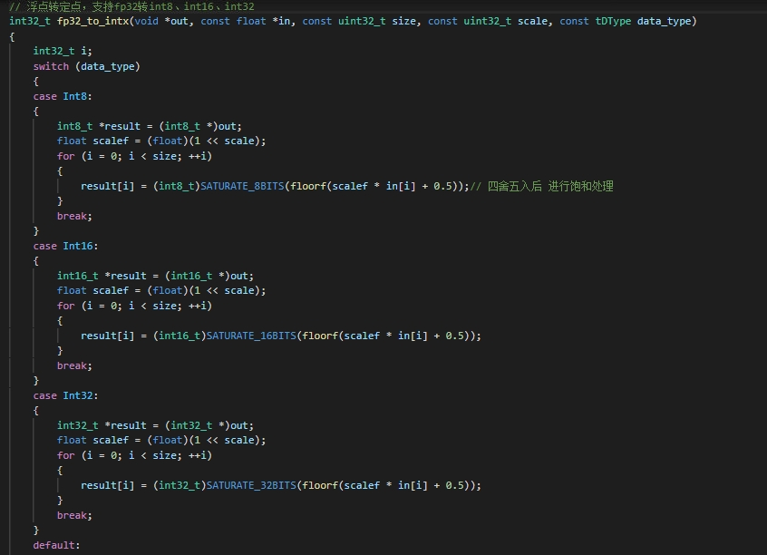

# CV通用函数接口库与通用函数库

### 通用函数API

#### void u8_to_int8(int8_t *out, const uint8_t *in, const uint32_t size);

##### API解释

并不是真正意义上的 u8_to_int8 函数，而是 **将uint8的数值向下偏移128**（0 - 255 -> -128 - 127），并使其能在int8中正常显示，这是因为uint8和int8不同的解析方式。

将uint8的最高位取反，恰好是int8中 该数 - 128 的表示。这种转换能够使得在int8表示时，数据在数据范围内的相对位置不变。

##### 实现方法


#### void int8_to_u8(uint8_t *out, const int8_t *in, const uint32_t size);

##### API解释

同上，将偏移的128偏移回来。

##### 实现方法


#### void abs_int8(int8_t *out, const int8_t *in, const uint32_t size);

##### API解释

如其名

##### 实现方法

太简单了，不写了。


#### int32_t fp32_to_intx(void *out, const float *in, const uint32_t size, const uint32_t scale, const tDType data_type);

##### API解释

浮点转定点，支持fp32转int8、int16、int32

同样对应的是下面这个方程，其实意义就是 浮点数转换成 定点数个精度：

`定点数 = round( 浮点数 * (1 << scale)） -> 浮点数 = 定点数 / (1<<scale)`

需要注意的是这里的scale是怎么确定的，比如要将【7.35、8.42、-3.63】转换为定点数，为了能够不损失精度地转换，选择其中绝对值最大的 8.42 ，并且为使精度尽量高，scale需要尽量大，所以相应的转换的数值要尽量大。

如果转换的定点数允许使用 int16_t （-32768 ~ 32767），那么最好是使8.42 对应的定点数尽量接近32767但不能超过（否则会损失准确性），而一旦绝对值最大的在范围内，那么其他的值一定不会饱和，所以可以放心。

计算的方法：
$$
scale = floor(log_{2}\frac{定点数}{浮点数}) =  floor(log_{2}\frac{32767}{8.42}) = floor(11.926) = 11
$$
注意：这里不能够四舍五入进到12，这是因为11.926是不饱和溢出的最大值，只能向下取整。

获得了scale后将其传入函数，参与上面的计算

##### 实现方法




#### int32_t intx_to_fp32(float *out, const void *in, const uint32_t size, const uint32_t scale, const tDType data_type);

##### API解释

定点转浮点，支持int8、int16、int32转fp32。

这个转换最重要的是两个参数 **scale 和 data_type**。scale 是 缩放系数（2的次方），决定了精度，scale越大意味着精度越高，相应地表示一个越大的数，需要传进来的 in 的值就需要越大，data_type决定了传进来的in的值最大为多少，和scale共同决定了浮点数的表示范围：

`定点数 = round( 浮点数 * (1 << scale)） -> 浮点数 = 定点数 / (1<<scale)`

其实意义就是 浮点数转换成 定点数个小数精度（1/(1<<scale)）。

##### 实现方法


#### int32_t transpose2d(void *out, const void *in, const uint32_t height, const uint32_t width, const tDType data_type);

##### API解释

2维数据转换，支持fp32、int8、int16、int32.

将内存空间中连续的 m * n 矩阵（实际上是数组，但是逻辑上是矩阵）转换为 连续的 n * m 矩阵，在某些合并内存数据的合并上有奇效。

##### 实现方法

即地址的计算，根据逻辑上的行数和列数 m , n ，计算源地址和目的地址位置，进行转换，不支持原地转换，否则会出现地址的覆盖。

以下以Float32为例，其实任何一种数据类型都是一样的，不过是定义指针时需要注意下。


#### int32_t filter(tData *out, const tData *in,const tData *kernel, const int32_t mode, tData *workspace);

##### API解释

滤波器，支持均值滤波、方框滤波、高斯滤波、中值滤波，其它方式可通过mode进行扩展

根据卷积的方式实现均值滤波、高斯滤波，使用快速排序的方式实现中值滤波、最小值滤波、最大值滤波。

从函数外开辟一个空间传入函数，根据准备好 传入的图像源数据和卷积核的数据，选择需要的滤波模式得到结果。


##### 实现方法


对源数据的处理：转置为[RRRRR,GGGGG,BBBBB]的独立通道形式、确认空间大小、将数据转变回偏移128并用int8表示（LUNA库的处理要求，必须是有符号类型，并且卷积过程会出现负值）。


对高斯卷积核的计算，根据opencv中的计算方法，计算卷积核，并将其转换为定点数。


由于卷积的过程是调用LUNA库的，所以这里省略。

对于排序滤波，这里写了一个快速排序来进行调用：


快速排序算法：

```c
// 快速排序算法，应用在中值滤波中
void quick_sort(uint8_t arr[], int8_t low, int8_t high)
{
    if (low < high)
    {
        uint8_t pivot = arr[high];
		int8_t i = low - 1;
        for (int8_t j = low; j <= high - 1; j++)
        {
            if (arr[j] < pivot)
            {
                i++;
                uint8_t temp = arr[il;
                arr[i] = arr[j];
                arr[j] = temp;
            }
        }
        uint8_t temp = arr[i + 1];
        arr[i + 1] = arr[high];
        arr[high] = temp;
        pivot = i + 1;
		quick sort(arr, low, pivot - 1);
		quick sort(arr, pivot + 1, high);
    }
}
```


#### int32_t normalize(tData *out, const tData *in, const tData *mean, const tData *var);

##### API解释

标准化函数，对源数据减均值除以标准差后的结果。（int8 -> int8）
$$
normalize = \frac{x - \mu}{\sigma}
$$


##### 实现方法

注意这里在计算的时候注意各定点数变量的缩放变量scale的一致性，对于加减计算，只有相同的scale的变量才可以进行计算，所以需要把 x 和 μ 的scale缩放到一致，在与σ计算的时候也同样要注意σ的scale，这个时候需要防止出现中间变量超过int16的情况，否则会溢出，另外还要考虑当将高scale转向低scale时，一定会出现精度的损失。


为了和opencv的结果保持一致，还需要对结果进行溢出的处理。opencv规定，如果得到的标准化结果不在【-128，127】中，超过127需要减256，小于-128需要加256：


#### int32_t image_preprocess(tData *out, const tData *in, const int32_t mode, tData *workspace,const tData *mean, const tData *var);


##### API解释

图像缩放后数据标准化输出int8数据

```c
/*
函数声明:int32t ommon processing_operations(tData *out,const tData *in, const nt32t mode, tData *workspace,const tData *mean, const tData *var)
作用:对图像进行缩放，转为int8后标准化输出，输入类型为uint8，输出类型为int8。
参数:
tData *out : 操作处理结果存放结构体，输出数据为int8，对图像的缩放要求存在其中;
tData *in : 源数据的存放结构体，输入数据为uint8;
int32_t mode : resize函数中的模式，暂时没有任何用处，填什么都可以;
tData *workspace : 数据暂存区，暂存区的大小填写在workspace->shape_.dims_[0]中;
tData *mean : 三个通道的平均值数据，数据存在dptr_地址，共三个int16数据(为了更加精确)，数的scale存放在mean->scale_中;
tData *var :同上，存放三个通道的标准差数据，数据存在dptr-地址，共三个int16数据，数据的scale存放在var->scale_中;
返回值:
int32_t : 返回代表执行成功，其余为失败。
*/
```

##### 实现方法

调用函数


### CV函数API

#### int32_t rgb2yuv(tData *out, const tData *in, const int32_t mode);

##### API解释

图像映射，RGB=>YUV

分了多个模式，有不同的转换标准，BT.470、BT.601等，还有RGB2YCbCr的模式，实际上就是是用公式：


##### 实现方法

使用矩阵乘法的原理获取结果，这里还有考虑调用的api的大小限制。


#### int32_t yuv2rgb(tData *out, const tData *in, const int32_t mode);

##### API解释

图像映射，YUV=>RGB

其实和上面的函数原理差不多，唯一需要注意的是两个特殊模式：**VYUY to RGB565 和 VYUY to BGR888**。关于这个内容，详细可以查看[VYUY to RGB565的方法](./YUV2RGB565/YUV2RGB565.md)。

##### 实现方法

这里使用LUNA调用的方法很机智，将偶数点与奇数点分开来计算得到相应的结果，最后再通过转置合并回原来的位置。


#### int32_t crop(tData *out, const tData *in, const int32_t *box);

##### API解释

// 图像裁剪，支持矩形框，四个点坐标由box给定

就是一顿memcpy，把要的位置的像素点复制一份到目的地址。

##### 实现方法


#### int32_t resize(tData *out, const tData *in, const int32_t mode, tData *workspace);

##### API解释

图像缩放，先支持双线性插值方式，关于双线性插值方式，详情可以看([OpenCV ——双线性插值（Bilinear interpolation） - Mr.Easy - 博客园 (cnblogs.com)](https://www.cnblogs.com/yssongest/p/5303151.html))

##### 实现方法

展示几个主要的步骤：


#### int32_t rotate(tData *out, const tData *in, const int32_t mode);

##### API解释

图像旋转，支持90、180、270度旋转，也可支持围绕水平或垂直轴翻转

本质上就是简单的地址运算，把什么位置的地址放到什么位置上去，就不做详细的解释了。

##### 实现方法


#### int32_t rgb2gray(tData *out, const tData *in, const int32_t mode);

##### API解释

图像映射，RGB=>GRAY

支持均值、最值、加权系数转换，其实就是把一个点的RGB三个值通过加权/最值/均值作为这个点的灰度值。

很简单。

##### 实现方法


#### int32_t gray2rgb(tData *out, const tData **in, const int32_t mode);

##### API解释

图像映射，GRAY=>RGB

直接灰度图像复制三份。

##### 实现方法

将灰色通道复制三份，需要注意转换成HWC排布，所以需要注意复制后的转置。


#### int32_t channel_split(tData *out, const tData *in, const int32_t mode);

##### API解释

图像通道分离，支持取RGB图像中的任一维度，或者取RGB均值输出

##### 实现方法

太简单了，不写了。


#### int32_t data_rearrangement(tData *out, const tData *in, const int32_t mode);

##### API解释

图像数据重排，RGBRGBRGB => RRRGGGBBB

##### 实现方法

转置即可，太简单了，不写了。


#### int32_t Pad(tData *out, const tData *in, const int8_t *pads, const int32_t mode, const uint8_t fill_data, tData *workspace);

##### API解释

边缘填充，借鉴onnx定义，pads数组对应每个维度的填充数，支持填充0，镜像填充，尾部填充三种方式

##### 实现方法

本质上还是在做地址操作，把源数据赋值到目的地址的位置。仅仅展示部分代码。


